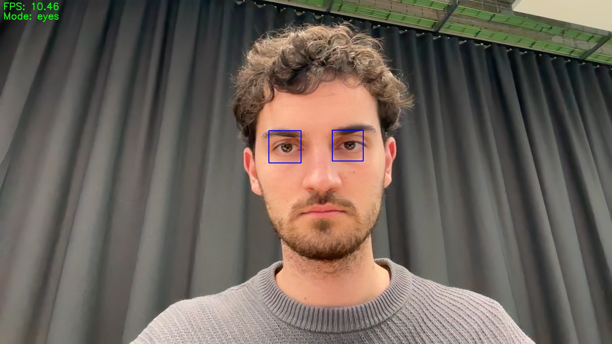
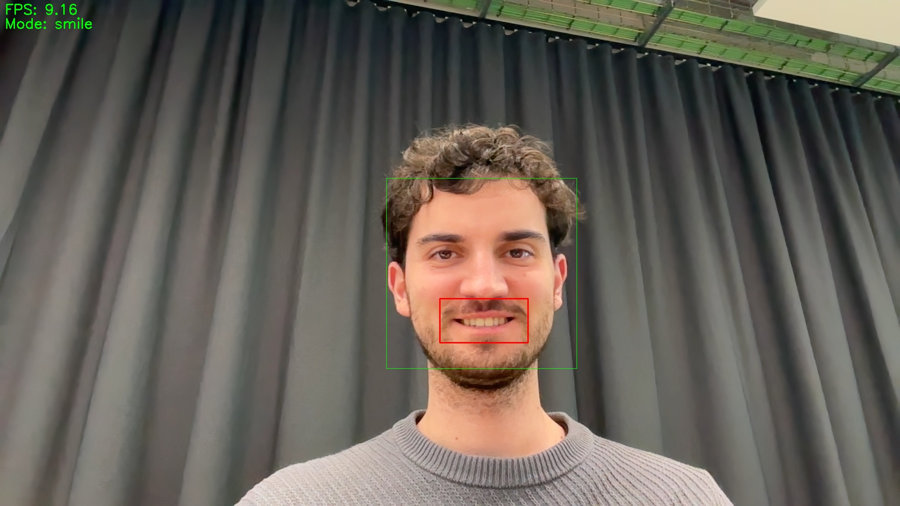

# 👤 Real-Time Face Detection

<div align="center">


A powerful and feature-rich face detection application that uses computer vision to detect faces, eyes, smiles, and facial landmarks in real-time.

</div>

## ✨ Features

### 🎯 Multiple Detection Modes
- **Face Detection**: Detect and track faces in real-time
- **Eye Detection**: Identify eyes within detected faces
- **Smile Detection**: Recognize smiles with smart filtering
- **Facial Landmarks**: Display 68 precise facial points

### 🎮 Interactive Controls
- Real-time parameter adjustment with trackbars
- Multiple detection modes with instant switching
- Facial landmarks toggle
- Video recording and screenshot capabilities

### 📊 Performance
- Real-time FPS counter
- Optimized detection algorithms
- Adjustable detection parameters for fine-tuning

## 📸 Screenshots

### Face Detection Mode

*Face detection with optional facial landmarks*

### Eye Detection Mode

*Precise eye detection within face regions*

### Smile Detection Mode

*Smart smile detection with reduced false positives*

## 🚀 Installation

### Prerequisites
- Python 3.x
- Webcam or camera device

### Step-by-Step Setup

1. **Clone the Repository**
   ```bash
   git clone https://github.com/yourusername/face_detection.git
   cd face_detection
   ```

2. **Install Dependencies**
   ```bash
   pip install -r requirements.txt
   ```

3. **Download Facial Landmarks Predictor**
   ```bash
   curl -L "https://github.com/italojs/facial-landmarks-recognition/raw/master/shape_predictor_68_face_landmarks.dat" -o shape_predictor_68_face_landmarks.dat
   ```

## 🎮 Usage

1. **Launch the Application**
   ```bash
   python face_detection.py
   ```

2. **Controls**
   | Key | Action |
   |-----|--------|
   | `m` | Switch detection mode (face/eyes/smile) |
   | `l` | Toggle facial landmarks |
   | `r` | Start/stop recording |
   | `s` | Take screenshot |
   | `q` | Quit application |

3. **Adjustable Parameters**
   - Use the "Min Neighbors" trackbar to adjust detection sensitivity
   - Use the "Scale Factor" trackbar to modify detection scale

## 💾 Output Files

All recordings and screenshots are automatically saved in the `output` directory with timestamps:
- Screenshots: `screenshot_YYYYMMDD_HHMMSS.jpg`
- Recordings: `recording_YYYYMMDD_HHMMSS.avi`

## 🤝 Contributing

Contributions are welcome! Here's how you can help:
1. Fork the repository
2. Create a new branch (`git checkout -b feature/improvement`)
3. Make your changes
4. Commit your changes (`git commit -am 'Add new feature'`)
5. Push to the branch (`git push origin feature/improvement`)
6. Create a Pull Request

## 📄 License

This project is licensed under the MIT License - see the [LICENSE](LICENSE) file for details.

## 🙏 Acknowledgments

- OpenCV for computer vision capabilities
- dlib for facial landmark detection
- The open-source community for various resources and inspiration